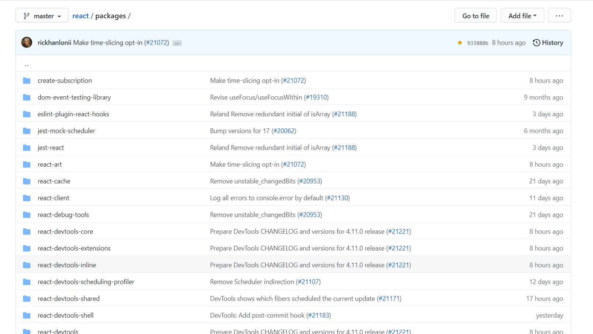

This is a notes file, where I capture my learnings/ takeaways while learning.
Somehow, writing makes me think and reflect, while learning, and moreover, this is another way of sharing my learning with everyone too.

(Once I watched Ben's videos, I also noticed that, I am learning few shortcuts along the way, which I am putting together in another file named: shortcuts (click it, go ahead and check it)- [shortcuts](shortcuts.md))

Firstly, my goal is to learn React/ React-Native. The reason being that, I observe that most of the established product companies are using React in their production, for example: 

1. Swiggy,
2.  Microsoft Bing,
3.  ServiceNow flow designer, 
4. Atlassian JIRA,

So, I was thinking if I could learn stuff and probably build my portfolio with this skill, which has widespread adoption.

While exploring through Youtube, I learnt that Ben Awad has created lots of playlists which guides people to learn React stuff.

I bumped into ben awad's playlist related to creating AirBnB clone app and website.
The reason for choosing this playlist was that, this was a fullstack project and I was interested to know, how a fullstacka application is written primarily in Javascript and that too, Airbnb clone, so why not.
I am basically a backend guy - core java.

A newbie to the world of React.

The introduction video was easy to follow, as it outlined the goal of the playlist - https://www.youtube.com/watch?v=kuswGIH-Xj8&list=PLN3n1USn4xlnfJIQBa6bBjjiECnk6zL6s&index=1

The second video outlined some of the things Ben follows while coding - which is useful for any newbie, so that, they can quickly learn the required things to speed up, in order to follow the playlist effectively. - https://www.youtube.com/watch?v=jEzZD_-ABBA&list=PLN3n1USn4xlnfJIQBa6bBjjiECnk6zL6s&index=2

While watching this video, I have installed some of the plugins mentioned by Ben - for example: 

1. vim for vscode- useful for vim enthusiasts and in general, good keyboard shortcuts to do many things in the editor
2. tslint - linting typescript code
3. prettier - code formatting
4. bracket colorizer - colorize matching brackets
5. graphql for vscode

To be honest, the third video with yarn workspaces was a little above my head. I wanted to know what is meant by monorepo, while Ben started speaking about yarn workspaces. So, I thought, let me take a little pause here, probably I need to watch the other playlist, where Ben talks about yarn workspaces in general.

So, this is a slight detour here, going from AirBnb playlist to yarn workspace playlist.

Now, yarn workspace playlist starts here.

The first video in this playlist - https://www.youtube.com/watch?v=G8KXFWftCg0&list=PLN3n1USn4xll1d97ZtIk2t7UpSxWGdIn5

talks about yarn workspace tutorial.

1. monorepo method - a new way to setup your projects - this method is being used by lot of projects , for example, babeljs, reactjs etc. they are starting to adopt it.
2. so, the concept of monorepo is, instead of having different packages in different repo with different folder structures, what you do is that, you put all your packages into a single repo. Taking the example of babeljs, there is a packages folder and under that, all the different packages of Babel come. So, I even looked up https://github.com/facebook/react, this is how it looks like.

3. And basically this is done by Babel (to be honest, at the time of writing, I don't know what is Babel) or React, by using a tool called yarn workspace.
4. firstly, what is the advantage of using yarn workspace - A) we can share dependencies across packages, B) we can also share code across multiple packages. (now I can understand why Ben was initially talking about yarn workspaces in Airbnb clone project, to share code between React & React Native project using Yarn workspaces. )
5. [yarn_workspace_project](my_yarn_workspace_project) from this point onwards, I am actually going to follow step by step and create a project to learn about Yarn workspaces, so the notes.md will be created in that project and I will share the link here - 
